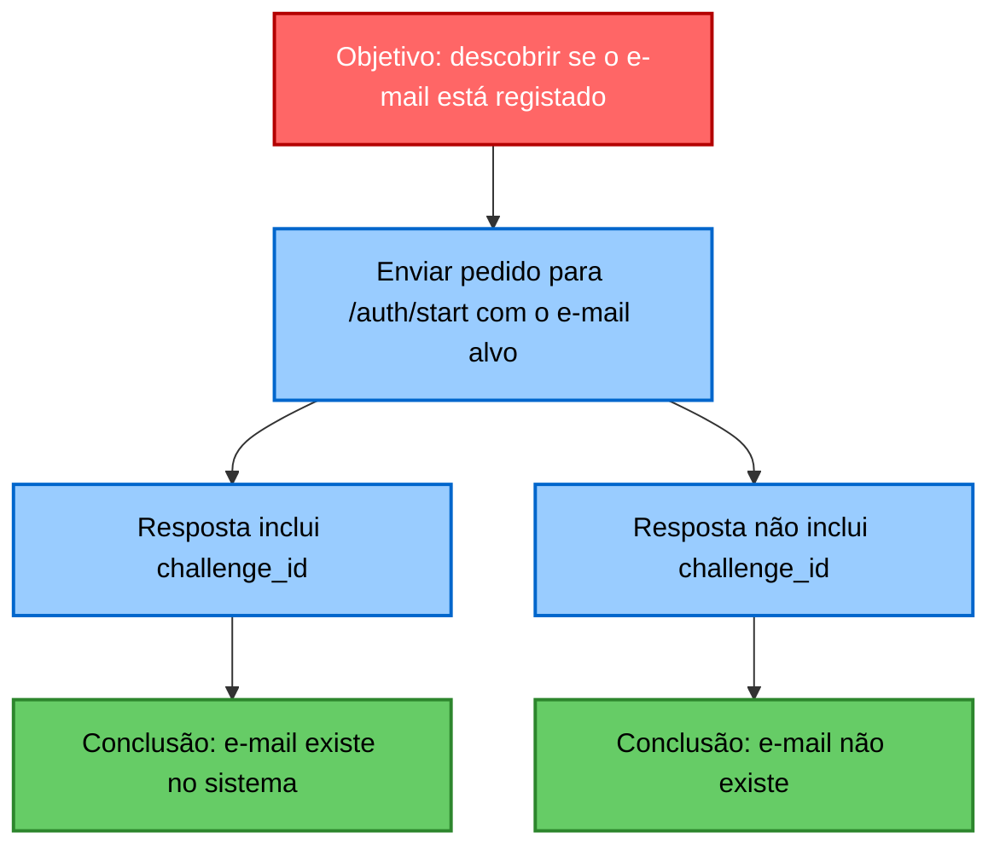
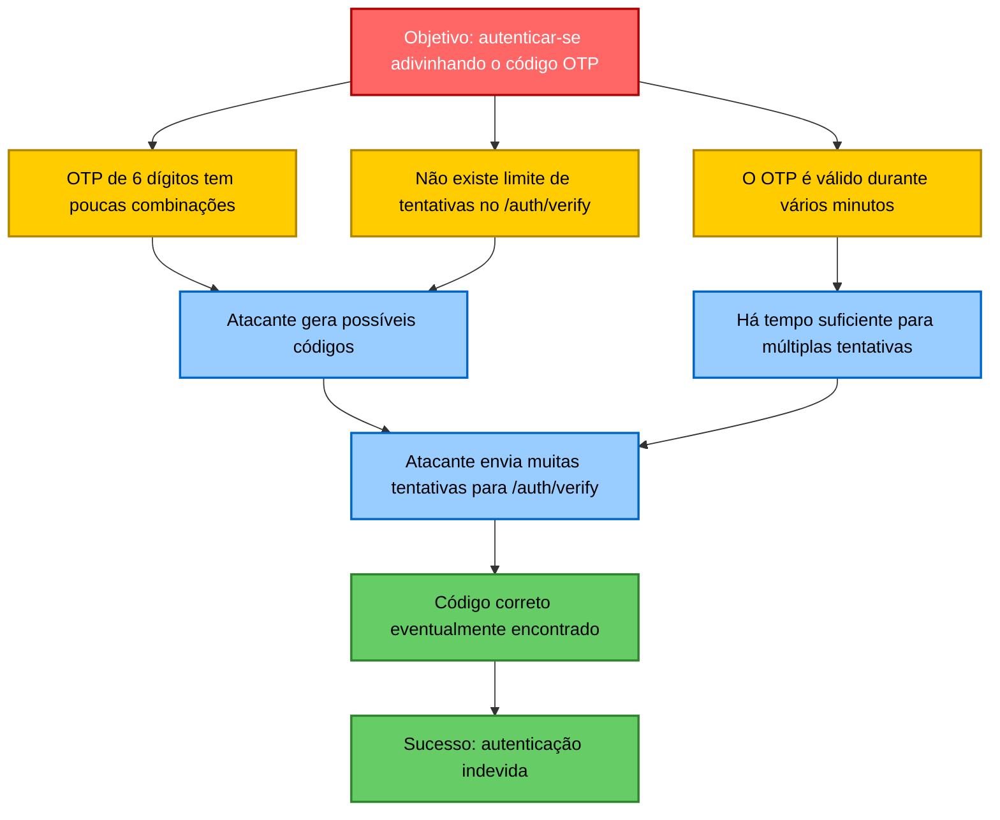
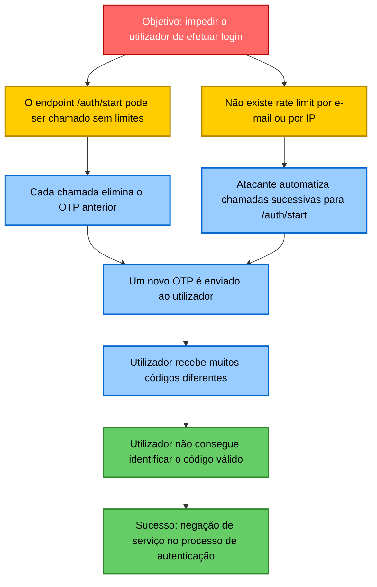
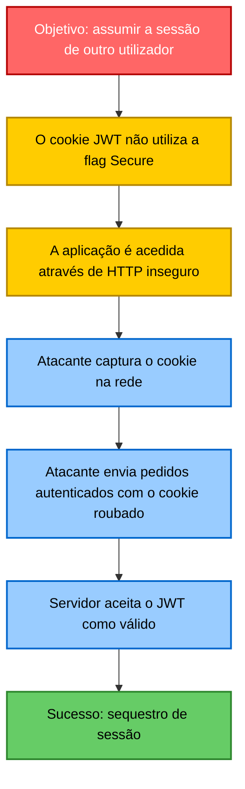

# Vulnerabilidades no BitsOfMe

Este documento descreve vulnerabilidades identificadas no BitsOfMe.

## Account Enumeration

O endpoint `/auth/start` retorna respostas **diferentes** dependendo se o e-mail existe ou não:

* **Email existe** → responde com `challenge_id`.
* **Email não existe** → responde apenas `"status": "ok"`.

Um atacante pode testar listas de e-mails e descobrir quem possui conta no sistema.



---

##  OTP Guessing Attack

O OTP possui:

* Apenas **6 dígitos** (900.000 possibilidades).
* **Nenhum rate limit** no endpoint `/auth/verify`.
* **TTL de 5 minutos**, proporcionando tempo suficiente para automatizar tentativas.

Com e-mail + challenge_id, um atacante pode testar códigos até acertar.



---

## OTP Flooding

O endpoint `/auth/start`:

* Não possui rate limit.
* Invalida o OTP anterior sempre que é chamado.
* Envia um novo email a cada chamada.

Assim, um atacante pode:

1. Disparar centenas de OTPs para a vítima.
2. Tornar impossível saber qual OTP é o válido.
3. Impedir a vítima de concluir o login.



---

## Session Hijacking via JWT Cookie

A configuração atual inclui:

```python
JWT_COOKIE_SECURE = False
```

Isto significa que **o cookie pode ser enviado em conexões HTTP inseguras**.

Em uma rede Wi-Fi pública, um atacante pode:

* Farejar o tráfego,
* Capturar o cookie de sessão (JWT),
* Assumir a identidade da vítima.

